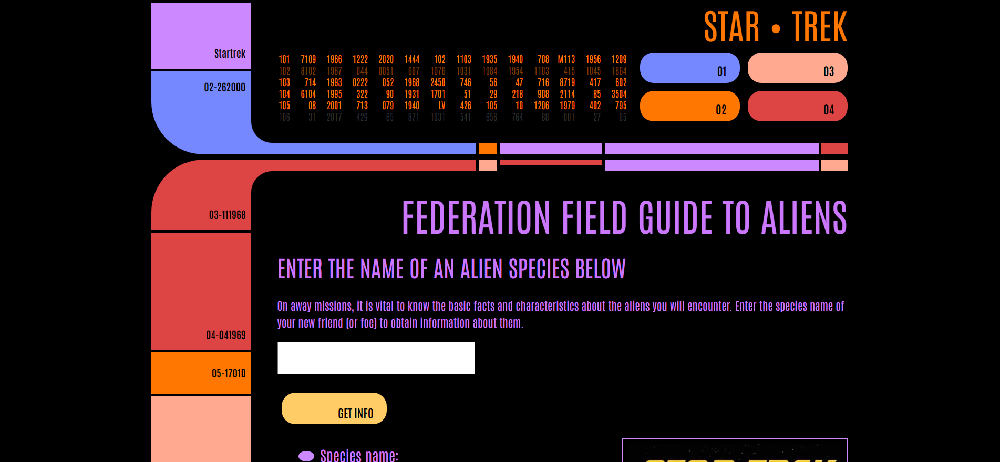

<h1 align='center'> Star Trek API | <a href='https://hellomitchellh.github.io/star-trek-client-side/'>Visit the app here!</a></h1>

<h2> Project Context</h2>

 This was a custom built API created using Node.js and Express, and hosted on Heroku.

 
 
<h2>What was learned</h2>

<ul>
 <li>Building backend API to serve JSON data</li>
 <li>Initializing Node.js and excluding node_modules with .gitignore file</li>
 <li>Using URL API parameters</li>
  <li>Working with JSON data</li>
 <li>Pushing and hosting API on Heroku</li>

 
</ul>

 

<h2>Optimizations</h2>

Move objects to database.

 

<h2>Tech Used</h2>
<ul>
<li>JavaScript</li>
<li>NodeJS</li>
<li>Express</li>
<li>CSS</li>
<li>HTML</li>
</ul>
